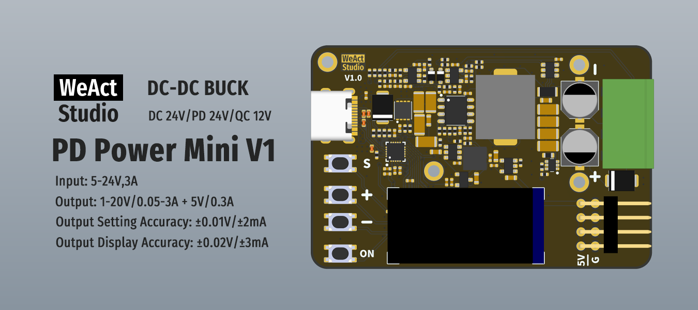
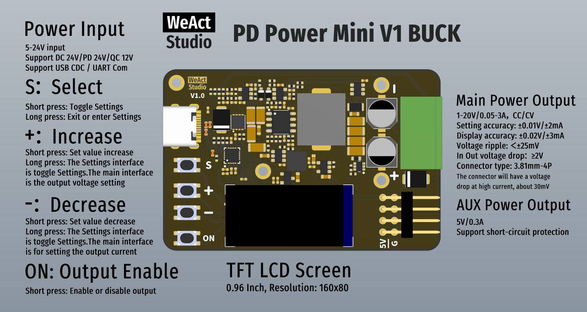
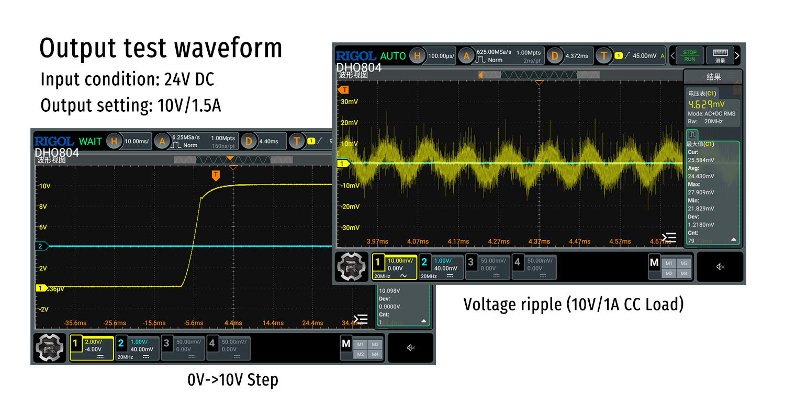
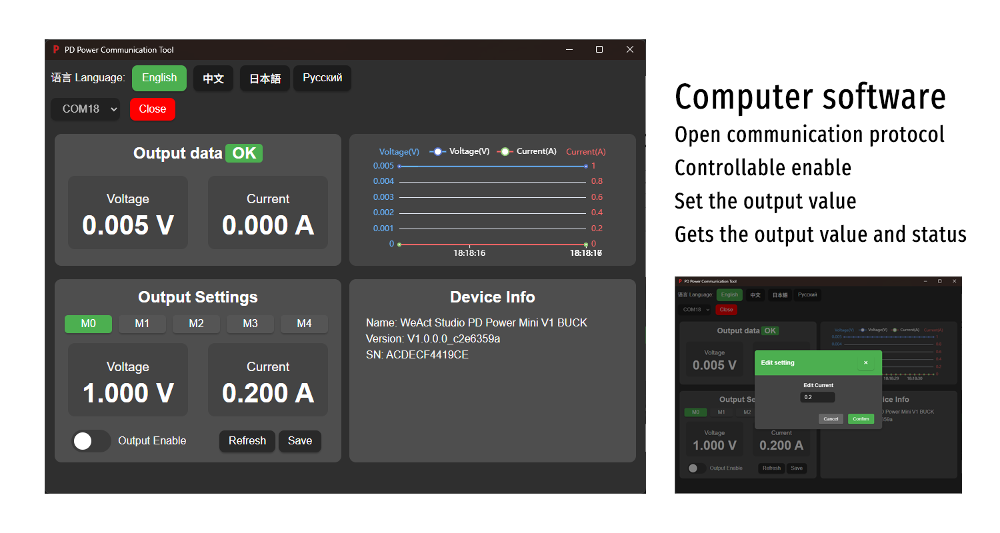

* [中文版本](./README_zh.md)
# WeActStudio.PDPowerMiniV1-Buck


|Specification||
|:-:|:-:|
|Input|DC 24V/PD 24V/QC 12V,3A|
|Output|1-20V/0.05-3A + 5V/0.3A|
|Output Setting Accuracy|±0.01V/±2mA|
|Output Display Accuracy|±0.02V/±3mA|
|Main Output Voltage Ripple|<±25mV|
|Output Protection|Overcurrent Protection,Short-circuit Protection|
> Note: The main output current of 2A can operate for a long time, while 3A current requires enhanced heat dissipation

## Product Introduction

### Setting Introduction
1. `PD Vset` – PD Protocol Request Voltage: Adjustable from 8–24 V, 0.1 V step. Setting takes effect only when output is disabled. <small>(V1.0.1.0 and above)</small>
2. `Brightness` – Brightness: Adjustable from 0–100%; 0–10% corresponds to ultra-low brightness.
3. `Reverse Dis` – Reverse Display: 0 = Normal, 1 = 180° rotation. Setting takes effect after power cycle.
4. `OCP Enable` – Over-Current Protection: 0 = Disabled, 1 = Enabled. Output shuts down after approximately 200 ms when current exceeds the set value.
5. `OC Discharge` – Over-Current Discharge: 0 = Disabled, 1 = Enabled. <small>(V1.0.0.2 and above)</small>
6. `AUTO OUT` – Auto Output: 0 = Disabled, 1 = Enabled. Output automatically enables after power-on.
7. `Filter.Win` – Output Filter Window: Adjustable from 1–200, default value 50. <small>(V1.0.0.3 and above)</small>
8. `Output Comp` – Output Compensation: 0 = Disabled, 1 = Enabled. <small>(V1.0.0.5 and above)</small>
9. `UART Mode` – UART Mode: 0 = Disabled, 1 = Enabled. Setting takes effect after power cycle. <small>(V1.0.0.5 and above)</small>
10. `UART Baudrate` – UART Baudrate: 0-6, respectively corresponding to 9600, 19200, 38400, 57600, 115200, 230400, 460800. <small>(V1.0.0.5 and above)</small>
11. `Factory Reset` – Factory Reset: Set to 1 and exit the settings menu to restore factory defaults (calibration values will not be cleared).
12. `Offset Enable` – Calibration Enable: 0 = Disabled, 1 = Enabled. Factory default is 1 (calibrated).
> UART pins are assigned to DP and DM of Type‑C connector:
DP → TX, DM → RX, 3.3 V logic level.  
`Note`: The external UART chip must feature reverse-current protection (e.g., CH340K) to prevent power backfeeding and PDPowerMiniV1 startup failure when the UART side is powered up first.

### Test Data

### Computer Software Introduction


```
/*---------------------------------------
- WeAct Studio Official Link
- taobao: WeActStudio.taobao.com
- aliexpress 1: WeActStudio.aliexpress.com
- aliexpress 2: WeActStudioOne.aliexpress.com
- github: github.com/WeActStudio
- gitee: gitee.com/WeAct-TC
- blog: www.weact-tc.cn
---------------------------------------*/
```
