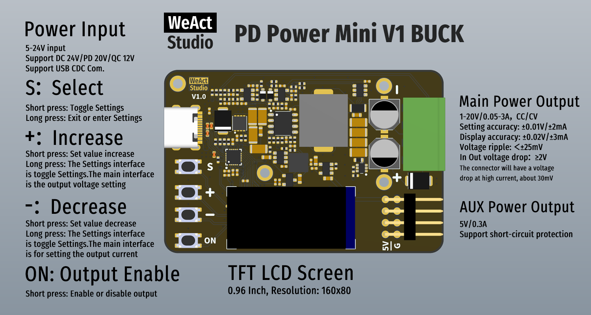

* [中文版本](./README_zh.md)
# WeActStudio.PDPowerMiniV1-Buck


|Specification||
|:-:|:-:|
|Input|DC 24V/PD 20V/QC 12V,3A|
|Output|1-20V/0.05-3A + 5V/0.3A|
|Output Setting Accuracy|±0.01V/±2mA|
|Output Display Accuracy|±0.02V/±3mA|
|Main Output Voltage Ripple|<±25mV|
|Output Protection|Overcurrent Protection,Short-circuit Protection|
> Note: The main output current of 2A can operate for a long time, while 3A current requires enhanced heat dissipation

# Product Introduction



```
/*---------------------------------------
- WeAct Studio Official Link
- taobao: weactstudio.taobao.com
- aliexpress: weactstudio.aliexpress.com
- github: github.com/WeActStudio
- gitee: gitee.com/WeAct-TC
- blog: www.weact-tc.cn
---------------------------------------*/
```
