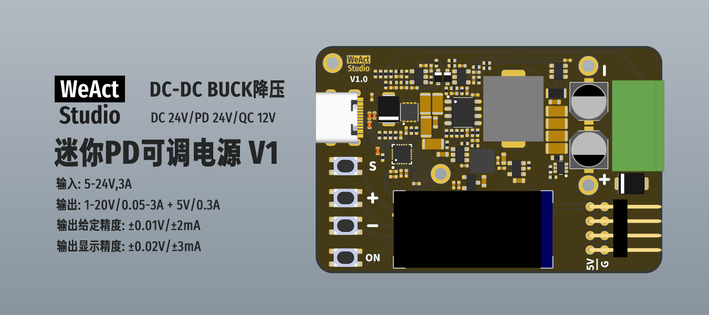
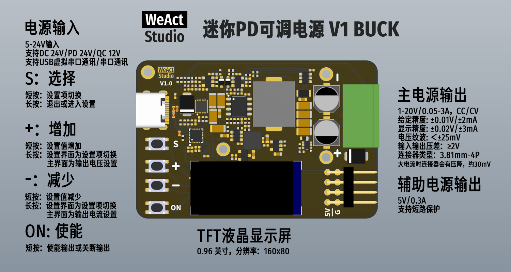
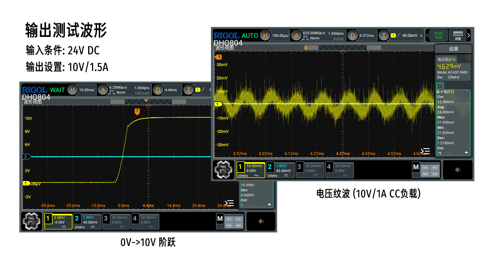
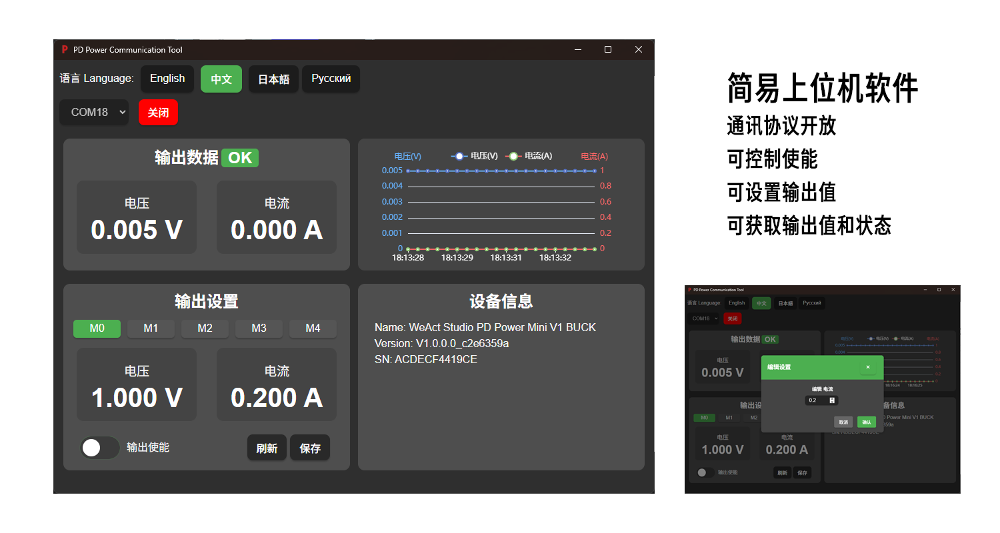

* [English version](./README.md)
# WeActStudio.PDPowerMiniV1-Buck


|规格||
|:-:|:-:|
|输入|DC 24V/PD 24V/QC 12V,3A|
|输出|1-20V/0.05-3A + 5V/0.3A|
|输出设置精度|±0.01V/±2mA|
|输出显示精度|±0.02V/±3mA|
|主输出电压纹波|<±25mV|
|输出保护|过流保护,短路保护|
> 注意: 主输出2A电流可长时间运行,3A电流需要加强散热

## 使用说明

### 设置项说明
1. `Brightness` 亮度： 0-100%设置，0-10%为超低亮度。
2. `Reverse Dis` 翻转显示：0为正常，1为翻转180°，重新上电生效。
3. `OCP Enable` 过流保护：0为不使能，1为使能，电流超过设置值200ms左右关断输出。
4. `OC Discharge` 过流放电：0为不使能，1为使能。<small>(软件版本V1.0.0.2及以上)</small>
5. `AUTO OUT` 自动输出：0为不使能，1为使能，上电后自动使能输出。
6. `Filter.Win` 输出滤波窗口设置：1-200，默认50。<small>(软件版本V1.0.0.3及以上)</small>
7. `Output Comp` 输出显示误差补偿：0为不使能，1为使能。<small>(软件版本V1.0.0.5及以上)</small>
8. `UART Mode` 串口通讯使能：0为不使能，1为使能，重新上电生效。<small>(软件版本V1.0.0.5及以上)</small>
9. `UART Baudrate` 串口波特率：0-6 分别对应9600,19200,38400,57600,115200,230400,460800。<small>(软件版本V1.0.0.5及以上)</small>
10. `Factory Reset` 恢复出厂设置：设置为1后退出设置界面恢复出厂设置(不会清除校准值)。
11. `Offset Enable` 校准使能：0为不使能，1为使能，出厂为1，已校准。
> 串口通讯管脚为TypeC连接器DP和DM引脚，`DP`→`TX`，`DM`→`RX`，3.3V电平。  
`注意`：外部串口芯片须具备防倒灌特性（例如 CH340K），防止串口先行上电，反向倒灌造成电源无法启动。
### 测试数据

### 上位机说明


```
/*---------------------------------------
- WeAct Studio Official Link
- taobao: WeActStudio.taobao.com
- aliexpress 1: WeActStudio.aliexpress.com
- aliexpress 2: WeActStudioOne.aliexpress.com
- github: github.com/WeActStudio
- gitee: gitee.com/WeAct-TC
- blog: www.weact-tc.cn
---------------------------------------*/
```