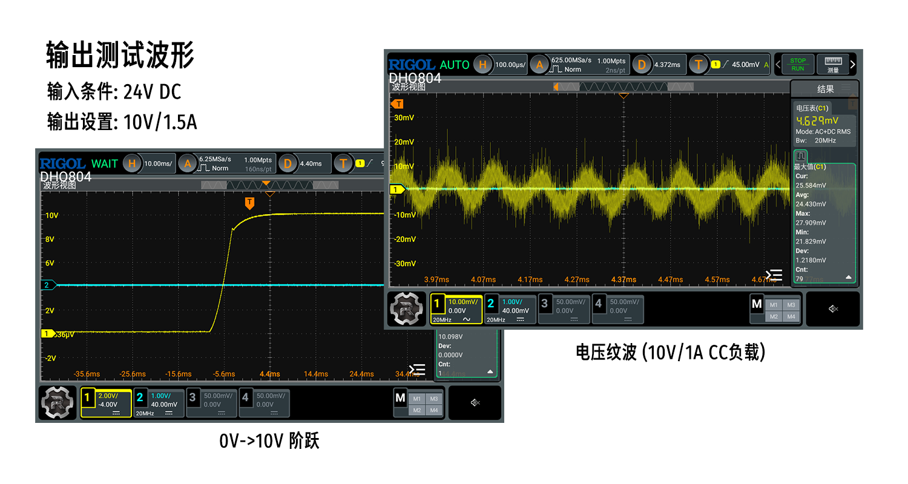

* [English version](./README.md)
# WeActStudio.PDPowerMiniV1-Buck


|规格||
|:-:|:-:|
|输入|DC 24V/PD 20V/QC 12V,3A|
|输出|1-20V/0.05-3A + 5V/0.3A|
|输出设置精度|±0.01V/±2mA|
|输出显示精度|±0.02V/±3mA|
|主输出电压纹波|<±25mV|
|输出保护|过流保护,短路保护|
> 注意: 主输出2A电流可长时间运行,3A电流需要加强散热

# Product Introduction




```
/*---------------------------------------
- WeAct Studio Official Link
- taobao: weactstudio.taobao.com
- aliexpress: weactstudio.aliexpress.com
- github: github.com/WeActStudio
- gitee: gitee.com/WeAct-TC
- blog: www.weact-tc.cn
---------------------------------------*/
```